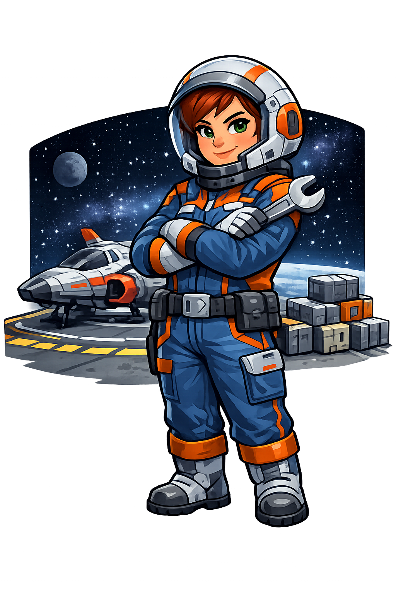

# Cargo Space

This game is a boardgame, with 2 - 6 players.

Each player has a space ship, that is the movement pawn

The board consists of 38 triangluar tiles. They are equilatiral triangles.
Two of these tiles are teleportation tiles. If a player lands on one of those, they are teleported to the corresponding tile.
Two of these tiles are asteroid belts. They are impassable.
Six of these tiles are landing tiles. These tiles connect directly to a planetary tile. They are labeled 1 - 6 and uniquely correspond to one of the six planets.
The remaining triangular tiles are movement tiles and are subdivided into 4 equilateral triangles. Each space represents a valid movement space.
There are 6 planet tiles. These tiles are rhomboids, equivalent to two triangular tiles, connected by one edge. These planetary tiles represent the destination for players to deliver their cargo.
There is one other piece, which is the central hub. The central hub piece is a hexagon, formed by three equilateral triangles. The map creation process begins by placing a random tile, edge to edge, with the hub. And continuing this process until either all tiles are on the board.
When a landing tile is placed, the corresponding planet tile must immediately be placed adjacent to it. 
There is one pyramid called the black hole. It starts out of play, but can be placed by a player on any non-planet tile (cannot be placed in the hub)

There are 52 cargo cards. 
Each card represents both a cargo type and color. There are four cargo types, and four cargo colors.
The types are :  Food, Energy, Material, Data
The colors are: Red, Blue, Gree, Yellow
There are also six wildcards. These can represent any type or color of cargo.

There are 50 'function' cards.
6 x Repari Bot: Unlock target player's cargo
2 x Mishap: Lockout target player's cargo
2 x Rebound: Target player returns to the hub
2 x Market Shift: Change the market of any one planet by putting the top discard pile card on that planet's market
2 x Hijack: You take ca cargo card from a player and that player must louch out their remaining cargo
2 x Upload: Place one of your cargo cards onto another player's depot.
2 x Impulse: Target player must shuffle all of their function cards back into the deck
2 x Expired license: Target player must put all their cargo cards at the bottom of their depot.
2 x Market Regulation: Switch any two planetary markets with eachoter
2 x Free Port: Play any one cargo card on your current Planet if it is open.
2 x Hinder: Place the black hole where you choose
2 x Recall: Send any player to the Hub. They must fill all empty cargo slots and cannot draw a Function card.
2 x Jammer: Choose one cargo unit for each player to lock down, including yourself
2 x Jettison: Target pleayer suffles one cargo caard of your choice into the Discard deck.
2 x Delivery: Target player fills their cargo slots from their depot
2 x Warp: Target player moves to a random planet
2 x Stealth:  Move four spaces. Nothing can block your movement (No asteroids, players or black holes can block movement)
2 x Data Switch: Switch one cargo card belonging to any player for another player's cargo card
2 x Jump: Target player jumps to any planet of card player's choice
2 x Glitch: Draw a new function card. Move your ship any number of spaces, up to 10.
1 x I.D. Fraud: Target player loads their open cargo slots from your depot
1 x Replicator: Reveal one of your function cards to all players. Play replicator as if it were that card.
1 x Breakdown: Target player skips their next turn
1 x Root: Look at target player's function cards. You must play one of those cards as your own.
1 x EMP: All players shuffle their function cards back into the deck. Including you.

The first phase is board creation.
Place the hub in the center of the table. Randomly shuffle all triangular tiles. Choose the first tile and place it adjacent to one of the hub's three edges. Draw another tile, place either next to the last tile, or either of the remaining hub edges.
Continue this process. If a planet placement card turns up, immediately place the corresponding planet next to that tile. Continue until all tiles are in play. 
When a planet tile is put into play, randomly place a cargo card on that planet. This represents the planet's market. The type or color of cargo it will accept from a player.

Ten cargo cards are placed face down on the hub.
The remaining cargo cards are dealt evenly to the players. Cards dealt to players must remain face down, this pile is called the 'Depot'. 
The remaining undealt cards are placed on the hub with the other cards.
Shuffle function cards and place them face down on the hub.
Each player may turn over the top 3 cards of their  depot. These cards are called the 'Cargo'
Play begins with player who has the most matching cargo cards. For instance, a player with three 'food' cards. If there is a tie between matching cargo types, the tie goes to the player having the most matching colors 
If there is a tie between these, both players forfeit first turn and the turn goes to the player having the second most matching cargo cards. Etc

Movement is done by rolling dice. There are two six-sided dice
If doubles are rolled, that player must choose to draw a function card or place the black hole on any eligible tile, blocking movement for all players through that tile.
The player can then move up to the number of spaces rolled. They do not have to move the entire amount.
A player cannot move through an asteroid belt tile, without using a special function card (see above)
A player cannot share a space with another player
A player cannot move through a tile blocked by the black hole, without a special function card (see above)
The objective is for a player to deliver their cargo cards to the planets. Only the cargo cards that match the type or the color of the planet's market can be played on a planet, unless a special function card is used to bypass this rule
When a cargo card is played on a planet, this becomes the new market card for that planet.
When passing through the hub, a player may use a turn to fill up their cargo, from their depot. If they have one or two cargo spaces open, they may draw the top card(s) of their depot and place into their cargo. If their cargo has been completely delivered when entering the hub, the player may fill their cargo slots and draw a function card.
On any turn, a player may opt to draw one card from the hub's depot deck and add to their depot. They are then sent to a randome selection of one of the six planets. It may be the same planet they are currently on. Effectively a no-op

The first player to return to the hub, after delivering all of their cargo and depot cards, is declared the winner.

